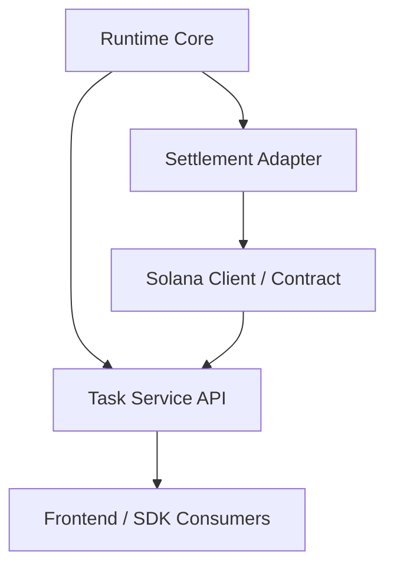

# AGORA Master Plan Design

Last updated: Saturday 11:24am, 04/11/2026

## Scope

This design covers the project as it actually exists today:

- a working Python deliberation runtime,
- missing chain/backend settlement and API integration,
- no implementation of dashboard code in this repo,
- and a need to lock a realistic project plan before broader implementation.

## Executive Read

| Question | Answer |
|---|---|
| What is already real? | Selector, debate engine, vote engine, monitor, hasher, orchestrator. |
| What is missing? | Real chain/backend settlement, task lifecycle API, dashboard-facing contracts. |
| What should be built next? | Shared runtime, chain backend, and API contract, then observability and API surface. |
| What should not be prioritized yet? | Delphi, MoA, quadratic voting, reputation weighting, frontend polish. |

## Real Gaps Between Docs And Code

| Area | Docs say | Code says | Gap |
|---|---|---|---|
| Product status | Full on-chain arbitration system | Working runtime with receipt generation only | Major |
| Solana integration | Josh track is part of the system plan | `agora/solana/client.py` now provides an HTTP bridge contract, but the backend is external | Major |
| API bridge | FastAPI endpoints are part of the design | No API package or routes in repo | Major |
| Frontend | Dashboard track exists | No frontend code in repo | Major |
| Architecture tooling | Graph workflow assumed | No harness existed before this pass | Moderate |
| SDK | Public integration story exists | Thin wrapper over orchestrator only | Moderate |

## Failure Modes To Plan Around

| Failure mode | Why it fails first | Mitigation |
|---|---|---|
| Runtime and chain disagree on receipt fields | Separate teams infer schema differently | Freeze one canonical contract before integration work |
| API grows around unstable runtime internals | No stable boundary exists yet | Define explicit request, event, and result models |
| Frontend starts on moving backend assumptions | UI contracts drift immediately | Frontend starts only after API payloads are frozen |
| Extra mechanisms get added before closure | More branches, more tests, more ambiguity | Hold scope to debate and vote until end-to-end flow is real |
| Orchestrator becomes a god object | It currently owns too many responsibilities | Introduce settlement and transport boundaries rather than growing orchestrator logic |

## Planning Approaches

### Approach 1: Finish The Existing Runtime Story First

| Attribute | Assessment |
|---|---|
| Summary | Freeze interfaces, implement settlement bridge, add API lifecycle, then wire dashboard. |
| Strength | Highest leverage, lowest risk, aligns with actual code state. |
| Weakness | Less flashy than adding new mechanisms. |
| Best when | The goal is to ship a defensible product instead of a broader prototype. |

### Approach 2: Build The Full Product Surface In Parallel

| Attribute | Assessment |
|---|---|
| Summary | Contract, API, frontend, and runtime all proceed together from the PDFs. |
| Strength | Fast visible progress across all tracks. |
| Weakness | High interface drift, duplicate work, weak integration discipline. |
| Best when | A stable system contract already exists. It does not here. |

### Approach 3: Expand Research Novelty First

| Attribute | Assessment |
|---|---|
| Summary | Add Delphi, MoA, reputation weighting, or richer adjudication before integration. |
| Strength | Maximizes apparent sophistication. |
| Weakness | Extends prototype drift and delays proof that the product claim is real. |
| Best when | End-to-end product path is already working. It is not. |

## Recommended Approach

Approach 1 is the correct path.

Reason:

- It solves the real bottleneck instead of the visible symptom.
- It makes the product claim more true, not just more elaborate.
- It reduces integration risk across the team.
- It preserves the strongest asset already built: the runtime core.

## Recommended System Boundary

Interpretation:

- The runtime should produce canonical task and receipt artifacts.
- A settlement adapter should own how those artifacts map to chain operations.
- The API should expose lifecycle and status, not leak internal engine behavior.
- The frontend should consume API-level contracts only.

## Locked Plan Proposal

### Phase 0: Planning And Interface Freeze

| Outcome | Deliverable |
|---|---|
| One canonical task lifecycle | Request, result, status, and progress schemas |
| One canonical receipt contract | Runtime output mapped to chain submission shape |
| Stable ownership boundaries | Explicit separation between runtime, chain, API, and frontend |
| Repeatable architecture visibility | Graph harness and generated snapshot |

### Phase 1: Settlement Closure

| Outcome | Deliverable |
|---|---|
| Runtime can submit receipts through a concrete adapter | Implement `agora/solana/client.py` |
| Runtime captures transaction metadata and statuses | Extend orchestration and integration contract |
| Deterministic task and decision identifiers | Shared conventions used across runtime and chain |
| Retry and idempotency policy | Prevent duplicate or partial settlement failures |

### Phase 2: API Surface

| Outcome | Deliverable |
|---|---|
| Submit task | API request and response contract |
| Query task | Status, result, receipt, tx signature |
| Stream task | Progress and mechanism-switch events |
| Integration tests | Runtime + API + chain sandbox |

### Phase 3: Consumer Surfaces

| Outcome | Deliverable |
|---|---|
| Dashboard contract | UI consumes task lifecycle and receipt payloads |
| SDK hardening | Public wrapper over stable API or service boundary |
| Operational observability | Structured events, metrics, failure codes |

### Deferred Until Closure

| Deferred item | Why deferred |
|---|---|
| Delphi and MoA | Adds complexity before product closure |
| Quadratic voting | Nice-to-have, not critical path |
| Reputation weighting | Depends on stable chain identity story |
| Frontend polish | Low leverage before backend contracts freeze |

## Joshua Critical Path

If you are owning the project at the planning layer, your immediate job is to keep the project from fragmenting.

| Priority | Joshua responsibility |
|---|---|
| 1 | Freeze task, receipt, and status contracts |
| 2 | Keep runtime, chain, and API boundaries explicit |
| 3 | Prevent duplicate implementation across tracks |
| 4 | Sequence frontend after backend contract stability |
| 5 | Hold extensions until end-to-end flow is real |

## Approval Gate

This design is ready for approval or revision.

What should be approved explicitly before broader implementation:

| Decision | Proposed answer |
|---|---|
| Primary approach | Finish existing runtime story first |
| Next build target | Runtime-to-chain backend and runtime-to-API contract freeze |
| Scope hold | Debate and vote only until end-to-end flow is closed |
| Architecture discipline | Frontend starts from frozen API contracts, not internal runtime assumptions |
