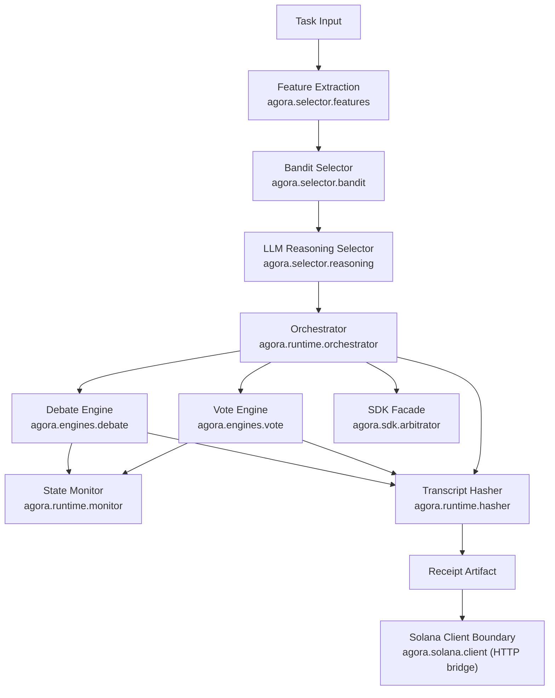
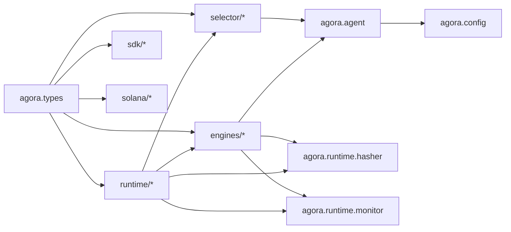

# Architecture Map

Last updated: Saturday 11:49am, 04/11/2026

Generated graph snapshot outputs live here:

- [GRAPH_REPORT.md](C:/Users/Mecha%20Mino%205%20Outlook/Documents/Mino%20Health%20AI%20labs/justjosh/agora/graphify-out/agora-runtime/GRAPH_REPORT.md)
- [graph.json](C:/Users/Mecha%20Mino%205%20Outlook/Documents/Mino%20Health%20AI%20labs/justjosh/agora/graphify-out/agora-runtime/graph.json)
- [extraction.json](C:/Users/Mecha%20Mino%205%20Outlook/Documents/Mino%20Health%20AI%20labs/justjosh/agora/graphify-out/agora-runtime/extraction.json)

## High-Level Shape

## Module Dependency View

## Hubs From The Snapshot

| Node | Why it matters |
|---|---|
| `agora.types` | Central contract for almost everything in the runtime. |
| `agora.runtime.orchestrator` | Main control surface and likely integration seam. |
| `agora.runtime.hasher` | Shared receipt primitive used by both engines and orchestrator. |
| `agora.runtime.monitor` | Shared adaptive control logic for switching and termination. |

## Community Map

| Community | Role |
|---|---|
| `agora.selector` | Decides which mechanism should run. |
| `agora.engines` | Executes the chosen deliberation mechanism. |
| `agora.runtime` | Coordinates execution and receipt generation. |
| `agora.solana` | HTTP-backed settlement boundary, but the backend is still external. |
| `agora.sdk` | Thin wrapper over orchestrator, not yet a true API product. |
| `tests` | Broad coverage of core runtime behavior. |

## What The Graph Makes Obvious

| Observation | Consequence |
|---|---|
| `agora.types` is the true shared contract hub | Changes here have wide blast radius and must be deliberate. |
| `agora.runtime.orchestrator` directly builds receipts | Settlement concerns are not yet abstracted behind an integration boundary. |
| `agora.solana` now has a real contract surface | Chain settlement itself is still external to this repo. |
| `agora.sdk.arbitrator` depends directly on the orchestrator | SDK design is still just a runtime wrapper, not a stable external contract. |

## Boundaries That Need To Be Frozen

| Boundary | Needed artifact |
|---|---|
| Runtime -> chain | Canonical receipt contract and task status contract |
| Runtime -> API | Submit task, run task, stream progress, query result shapes |
| API -> frontend | Stable event stream and result payload |
| Runtime -> SDK | Public method contract that does not leak internal engine structure |
